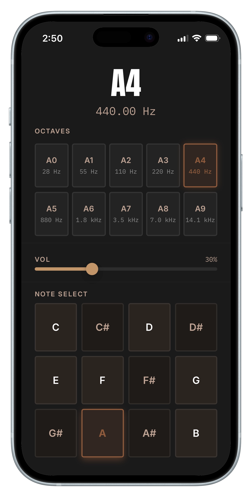

# ToneKey

A web-based sine wave tone generator for identifying frequencies in live sound environments.

## Features

- Pure sine wave across the full audible range (20 Hz – 20 kHz)
- 12-key note selector + octave navigation for quick frequency browsing
- Exponential volume curve for fine control at low levels
- Equal-loudness compensation (ISO 226) — auto-adjusts volume when changing frequency
- iOS silent switch bypass (iOS 16.4+)
- Single HTML file, no dependencies

## Add to Home Screen

Open ToneKey in your mobile browser and use the "Add to Home Screen" option to launch it like a native app.

## Tech Stack

- HTML + CSS + JavaScript (single file, no build tools)
- Web Audio API (OscillatorNode, GainNode)
- ISO 226:2003 equal-loudness contours
- GitHub Pages (static hosting)
